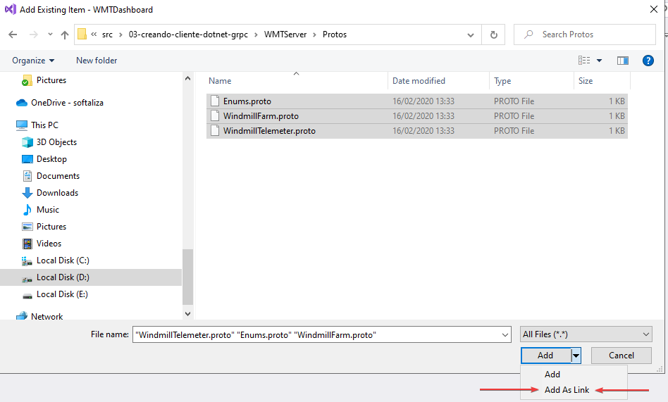

[< Volver al inicio](../README.md#exercises)

[< Ejercicio anterior](02-creando-servicio-grpc.md)

# Creando un cliente en .Net Core para el servicio

Bueno, ya tenemos el servidor funcionando, pero para que todo esto tenga sentido necesitamos un cliente que consuma los servicios. De hecho crearemos dos!  

## Cliente web MVC WMTDashboard

El primero de ellos va a ser una web simple MVC que exponga los datos actuales de cada generador eólico. Este es nuestro proyecto `WMTDashboard`.  
Al igual que en el servidor, empezaremos por los archivos proto. Así que para mantener la sincronía entre cliente-servidor incluiremos los mismos ficheros que ya tenemos en WMTServer como link (Directorio Protos -> click dcho -> Añadir -> Elemento existente -> buscamos el archivo del server y desplegamos la opción del botón Abrir)  



Recordemos además que tenemos que ajustar las propiedades de los ficheros proto  para establecer _Build Action_ a _Protobuf compiler_ y _gRPC Stub Classes_ en esta ocasión a _Client only_. Ahh, ¿recuerdas también que en el servidor añadimos la propiedad _AdditionalImportDirs_?

Una vez que tenemos los archivos proto en el proyecto y se autogenera el código de cliente, solo tenemos que registrar estos en la clase `Startup` para poderlos inyectar en nuestros controladores. Modifica el código para que quede así:

```csharp
public void ConfigureServices(IServiceCollection services)
{
    services.AddGrpcClient<WindmillFarm.WindmillFarmClient>(options => options.Address = new Uri(Configuration["WindmillServiceEndpoint"]));

    services.AddControllersWithViews();
}
```

Veamos que hacen estas líneas. `Configuration["WindmillServiceEndpoint"]` no es más que una configuración que hemos puesto previamente para saber cual es la url del servidor, puedes encontrarla en el archivo `appsettings.json`.  
`services.AddGrpcClient<TClient>` registrará el cliente autogenerado en el contenedor de AspNetCore, además nos da opción de configurar tanto la url del servidor como las opciones del canal mediante `ChannelOptionsActions` y añadir interceptores al flujo de comunicación.

Ahora extendamos nuestro controlador `Home` para que la vista principal de la web muestre los datos de los datos:

```csharp
using System.Diagnostics;
using System.Linq;
using System.Threading.Tasks;
using Grpc.Core;
using Microsoft.AspNetCore.Mvc;
using Microsoft.Extensions.Logging;
using WMTDashboard.Models;
using WMTServer;

namespace WMTDashboard.Controllers
{
    public class HomeController : Controller
    {
        private readonly ILogger<HomeController> logger;
        private readonly WindmillFarm.WindmillFarmClient client;

        public HomeController(ILogger<HomeController> logger, WindmillFarm.WindmillFarmClient client)
        {
            this.logger = logger;
            this.client = client;
        }

        public IActionResult Index()
        {
            var response = client.RequestList(new WindmillListRequest());
            return View(response.Windmills.ToList());
        }

        public IActionResult Privacy()
        {
            return View();
        }

        [ResponseCache(Duration = 0, Location = ResponseCacheLocation.None, NoStore = true)]
        public IActionResult Error()
        {
            return View(new ErrorViewModel { RequestId = Activity.Current?.Id ?? HttpContext.TraceIdentifier });
        }
    }
}
```

Y por último la vista para sacar los datos, cambia `Views/Home/Index.cshtml` a:

```csharp
@model List<WMTServer.WindmillInfo>
@{
    ViewData["Title"] = "Home Page";
}

<div class="text-center">
    <h1 class="display-4">Windmill Farm Dashboard</h1>
    <p>Windmills in the farm:</p>
</div>
<div>
    <table class="table  table-striped">
        <thead>
            <tr>
                <th scope="col"></th>
                <th class="text-center" scope="col" colspan="2">Average Power</th>
            </tr>
            <tr>
                <th scope="col">Windmill Id</th>
                <th class="text-center" scope="col">Last minute</th>
                <th class="text-center" scope="col">Last hour</th>
            </tr>
        </thead>
        <tbody>
            @foreach (var windmill in Model)
            {
                <tr>
                    <th scope="row">@windmill.WindmillId</th>
                    <td class="text-center">@windmill.AvgPowerGeneratedLastMinute.ToString("F") W/h</td>
                    <td class="text-center">@windmill.AvgPowerGeneratedLastHour.ToString("F") W/h</td>
                </tr>
            }
        </tbody>
    </table>
</div>
```

Et voilà! Ya tenemos nuestro primer cliente del servicio gRPC.

## Cliente de consola WMTLogger

Dado el propósito del protocolo y la cantidad de soluciones que pretende abarcar, el uso de servicios gRPC no está limitado a la web y bien podría servir para recibir datos en cualquier tipo de aplicación, como es el caso de este logger, donde mediante un stream recibiremos continuamente eventos desde el servidor.

Para comenzar repetiremos los pasos de incluir los archivos proto como enlaces y ajustar sus propiedades para autogeneración de clientes.

El código de `Program` quedará del siguiente modo:

```csharp
using System;
using System.Linq;
using System.Threading;
using System.Threading.Tasks;
using Grpc.Core;
using Grpc.Net.Client;
using WMTServer;

namespace WMTLogger
{
    public class Program
    {
        public static async Task Main(string[] args)
        {
            var channel = GrpcChannel.ForAddress("https://localhost:5001");
            var client = new WindmillFarm.WindmillFarmClient(channel);

            var windmills = client.RequestList(new WindmillListRequest());
            var guid = windmills.Windmills.FirstOrDefault()?.WindmillId;

            if (Guid.TryParse(guid, out var windmillId))
            {
                Console.WriteLine($"Windmill info for {guid}");
                await TelemetryStreaming(windmillId, channel);
            }

            Console.WriteLine("Shutting down client");
            Console.WriteLine("Press any key to exit...");
            Console.ReadKey();
        }

        private static async Task TelemetryStreaming(Guid guid, GrpcChannel channel)
        {
            var cts = new CancellationTokenSource();
            cts.CancelAfter(TimeSpan.FromSeconds(27));

            var client = new WindmillTelemeter.WindmillTelemeterClient(channel);

            using (var call = client.RequestTelemetryStream(new WindmillInfoRequest{WindmillId = guid.ToString()}, cancellationToken: cts.Token))
            {
                try
                {
                    await foreach (var wi in call.ResponseStream.ReadAllAsync())
                    {
                        Console.WriteLine($"Windmill info at {wi.EventTime}: {{RPM={wi.RPM},Power={wi.PowerOutput},Voltage={wi.VoltageOutput}}}");
                    }
                }
                catch (RpcException ex) when (ex.StatusCode == StatusCode.Cancelled)
                {
                    Console.WriteLine("Cancelling telemetry reading.");
                }
            }
        }
    }
}
```

Veamos:

- Creamos un `GrpcChannel` con la url  donde se aloja el servicio.
- Con el canal configurado instanciamos un `WindmillFarmClient` para obtener el GUID del primer molino que tenga la colección.
- A continuación al método `TelemetryStreaming` le damos el GUID del molino del que recibir datos y el canal que ya configuramos, para crear un nuevo cliente del tipo `WindmillTelemeterClient`.
- Para leer datos del stream simplemente invocamos el método `RequestTelemetryStream` y mediante su propiedad `ResponseStream.ReadAllAsync()` leemos los datos hasta que bien el servidor termine el stream o bien nuestro cliente decida que no quiere leer más datos, lo cual forzamos en este ejemplo mediante el cacellation token en 27 segundos.

Y así de simple es generar un par de clientes que consuman datos del servicio.

Vamos a ver si nos sale algo un poco más retorcido, pasa al siguiente ejercicio para la sorpresa.

[Siguiente ejercicio >](04-creando-cliente-go-grpc.md)
